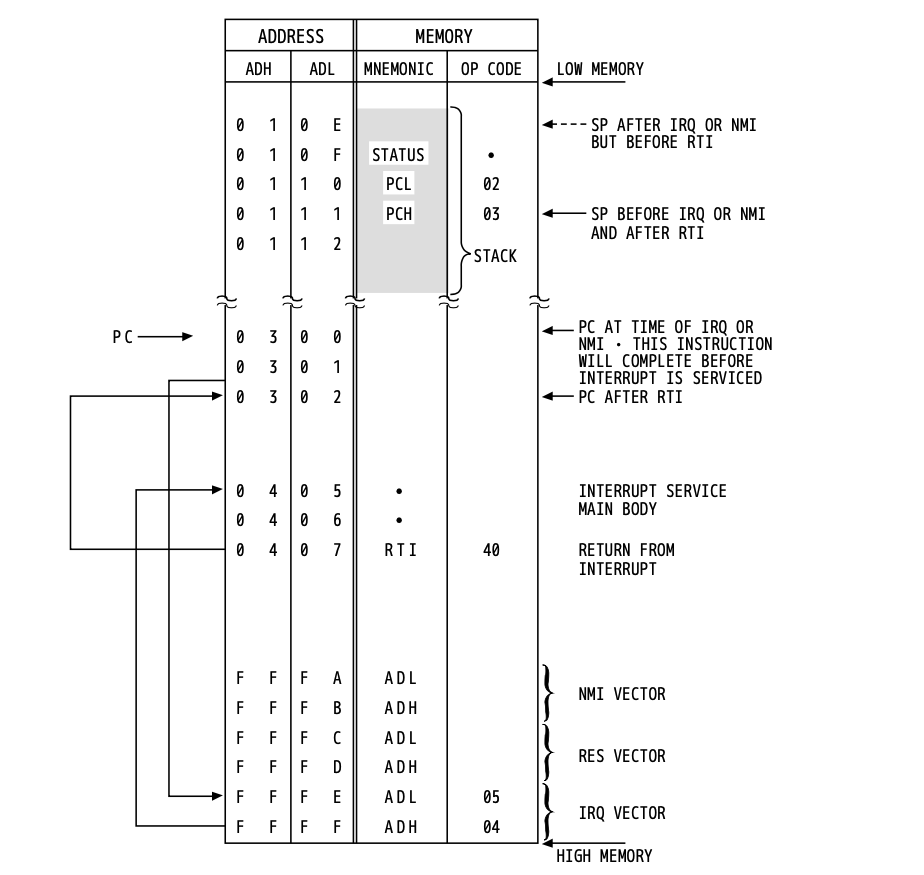

memory map

zpg    0x0000 - 0x00FF 256b
stack  0x0100 - 0x01FF 256b
input  0x0200 - 0x02FF 256b
page3  0x0300 - 0x03FF 256b
ram    0x0400 - 0xBFFF 48kb
output 0xC000 - 0xCFFF 4kb
ROM    0xD000 - 0xDFFF 4kb 
graph  0xE000 - 0xFFEF 8175b
vector 0xFFF0 - 0xFFFF 16b